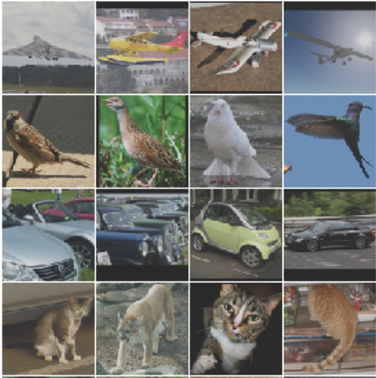

**Projeto Final - Processamento de Imagens**

**Nome:** Aline Becher 

**NUSP:** 10492388

**Tema:** Recuperação de Imagens Baseada em Conteúdo

**Título:** Algoritmo K-means para recuperação de imagens baseada em cor e textura

O objetivo deste projeto é implementar o algoritmo k-means para a recuperação de imagens baseada em cor e textura. 
Métodos de agrupamento permitem reduzir a dimensão do conjunto de dados, uma vez que concentra a informação em cada um dos seus centros. Desta forma as imagens são agrupadas em conjuntos mutuamente similares e distantes de imagens de conjuntos diferentes.

Etapas de desenvolvimento: 

**1) Pré-processamento:** O pré processamento das imagens do conjunto de dados será feito utilizando equalização de histogramas ou ajuste gamma (conforme escolha do usuário).

**2) Extração de Características:** Inicialmente as imagens são convertidas para um único canal de cor, através do método Luminance. A extração de características das imagens já convertidas será feita com base em histograma de cores e descritores de textura. Afim desde passo, será obtidos dois vetores de características (cor e textura).

**3) Algoritmo K-means:** O algoritmo K-means permite separar o conjunto em K subconjuntos. Para cada um deles é encontrado um centróide que permite agrupar as imagens ais similares a cada um deles. Aqui, será utilizado para classificação os vetores de características, obtidos no passo anterior.

**4) Recuperação de Imagens** Dada uma imagem de entrada, que será processada como na etapa 1, o algoritmo irá calcular a similaridade entre esta imagem e cada um dos K centróides obtidos na etapa 3 e irá retornar as imagens mais similares ao centróide mais próximo.

Para o desenvolvimento desta proposta será utilizado o dataset STL-10, com-
posto por 100000 imagens em 10 classes distintas, disponivel em https://cs.stanford.edu/%7Eacoates/stl10/.

